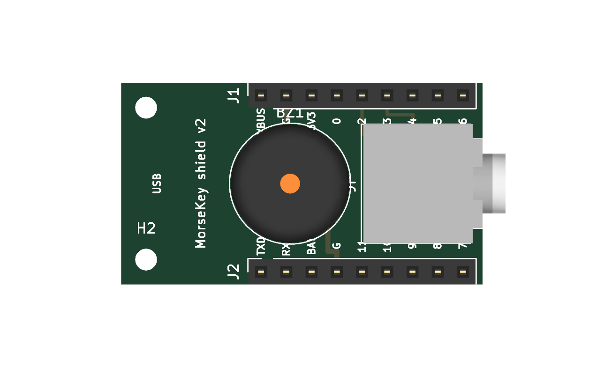
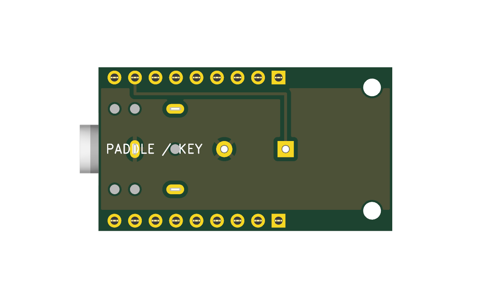

# WaveMorse

Turn a **Waveshare ESP32-S3-LCD-1.47B** (USB-C board with the 1.47" screen)
into a USB morse key for the **Morse-It** iOS app: plug an iambic paddle
(or straight key) into the ESP32, plug the ESP32 into an iPhone, and key
away — with live decode on the built-in LCD.

- **Firmware** (`morsekey/`): iambic keyer (Curtis A/B), USB MIDI device
  the phone recognizes natively (TinyMIDI-style), on-screen decode of what
  you send, straight-key auto-detection, optional piezo sidetone.
- **Shield PCB** (`shield/`): a fab-ready snap-on board with the same
  footprint as the ESP32 board — 3.5mm jack, piezo, female headers.
  Gerbers included; see [shield/README.md](shield/README.md).

| Shield top | Shield bottom |
|---|---|
|  |  |

(The non-B USB-A variant of the board also works — change `PIN_LCD_BL` to
48 and the paddle pins to 1/2 in `morsekey/config.h`.)

Plugged into an iPhone 15, the phone powers the board and Morse-It sees it as
a MIDI input device — the same mechanism the N6ARA TinyMIDI uses.

## Wiring the paddle

The paddle connects to the board's edge header. With a 3.5mm TRS jack
(standard paddle wiring):

| Paddle / jack        | Board header pin |
|----------------------|------------------|
| Tip (left paddle)    | **GPIO2** (dit)  |
| Ring (right paddle)  | **GPIO3** (dah)  |
| Sleeve (common)      | **GND**          |

All three are on the edge header (follow the silkscreen labels GND, 2, 3).
The inputs use internal pull-ups; the paddle just shorts them to ground — no
resistors needed. If dit/dah feel reversed, flip "Paddle: Swapped" in the
settings menu (or swap the wires). Free header GPIOs on this board are
2–11; avoid 1 (battery ADC) and 12/13 (IMU interrupts).

## Connecting to the iPhone

A plain **USB-C to USB-C cable** — the phone powers the board (~100 mA,
well within what the port supplies). The board enumerates as a MIDI device
named **MorseKey**.

## Morse-It setup

Two ways to use it — pick one in the settings menu ("MIDI" item):

**PADDLE mode (default, recommended).** The board sends the raw paddle
contacts as two MIDI notes (dit = note 60, dah = note 61) and Morse-It runs
its own iambic keyer, sidetone and speed:
1. In Morse-It, set the key type to **Iambic Paddle**, matching the A/B
   mode shown on the board (default: A).
2. In the settings, under the hardware/MIDI interface section, select the
   **MorseKey** MIDI device and assign the two notes to the dit and dah
   areas (use the app's "learn" function: tap the field, press a paddle).
3. Set Morse-It's keyer speed to match the WPM shown on the board's screen
   so the on-screen decode matches what the app hears.

**KEYER mode.** The board does the iambic keying itself and sends the result
as a single on/off note (note 62) — configure Morse-It as a **Straight Key**.
What Morse-It receives is then exactly what the board's screen shows, and
speed is controlled on the board.

## Controls

**BOOT quick press** opens the on-screen settings menu; **BOOT held ~1 s**
(outside the menu) toggles iambic A/B directly — the status bar reflects it
immediately. In the menu, navigate with the paddle:

| Input in menu     | Effect                                   |
|-------------------|------------------------------------------|
| Dit paddle        | Next item                                |
| Dah paddle / BOOT tap | Change the selected value            |
| BOOT held ~1 s    | Save and exit                            |

Settings: speed (10–30 WPM), iambic A/B, MIDI mode (Paddle/Keyer), paddle
swap, sidetone on/off. All persist across power cycles. With a straight
key plugged in, navigate with the key and change values with BOOT taps.

The screen shows a status bar (WPM,
iambic mode, MIDI mode, USB state), the in-progress dit/dah pattern in
yellow, and the decoded text in green. The RGB LED is red while keying, dim
cyan at idle in PADDLE mode, dim green in KEYER mode. Unrecognized patterns
decode as `#`.

## Building and flashing

With [arduino-cli](https://arduino.github.io/arduino-cli/):

```sh
arduino-cli config add board_manager.additional_urls \
  https://espressif.github.io/arduino-esp32/package_esp32_index.json
arduino-cli core update-index
arduino-cli core install esp32:esp32
arduino-cli lib install "GFX Library for Arduino"
./flash.sh
```

Or in the Arduino IDE, open `morsekey/morsekey.ino` with these Tools
settings: board **ESP32S3 Dev Module**, USB Mode **USB-OTG (TinyUSB)**
(required for MIDI), USB CDC On Boot **Enabled**, Flash Size **16MB**,
PSRAM **OPI PSRAM**. Install the "GFX Library for Arduino" library.
(IDE builds enumerate with the generic name "ESP32S3_DEV" — the "MorseKey"
device name comes from a `-DUSB_PRODUCT` flag that `flash.sh` sets; either
name works fine in Morse-It.)

If the board doesn't appear as a serial port when flashing (e.g. first
flash), force the bootloader: hold **BOOT**, tap **RESET**, release BOOT.

## Configuration

Runtime settings live in the on-screen menu. Compile-time options in
`morsekey/config.h`: paddle/piezo pins, MIDI note numbers, sidetone pitch,
and defaults.

## Shield PCB

`shield/` contains a manufacturable snap-on shield (KiCad design, Gerbers,
1:1 placement PDF) with the same footprint as the board: one 3.5mm jack
that takes either a paddle (TRS) or a straight key (TS mono — auto-detected,
status bar shows `SKEY`), plus an optional piezo sidetone on GPIO5. See
`shield/README.md` for ordering and assembly.

## Possible extensions

- **BLE MIDI**: the ESP32-S3 has Bluetooth; Morse-It also accepts BLE MIDI,
  which would make the key wireless (the board has a LiPo charger and BAT
  connector).
- **IMU gestures**: the onboard QMI8658 accelerometer could open the menu
  on a double-tap.
